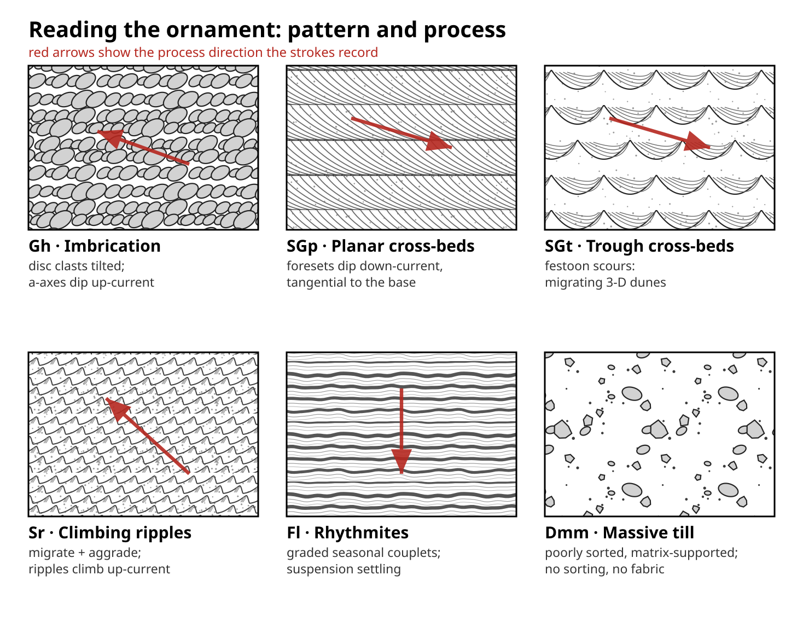
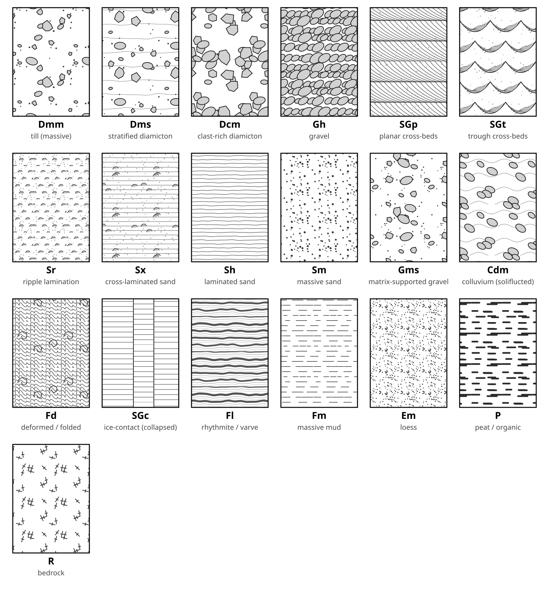
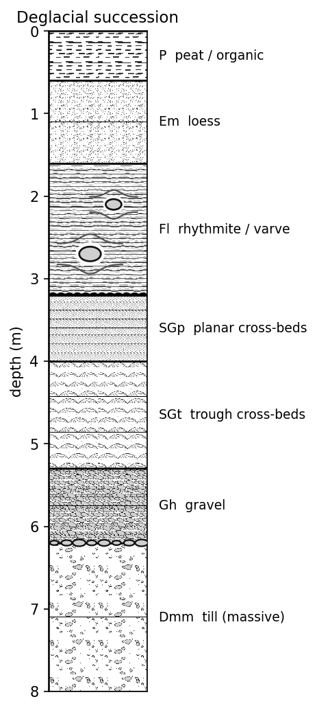

# glacial-strat-patterns

**Tileable fill patterns for glacial / Quaternary stratigraphic columns** — the
kind of black line-work you pour into a measured section, but with a real
glacial vocabulary that the USGS/FGDC lithologic set lacks: diamicton/till
families, rhythmites, **dropstones that deflect the laminae**, cross-bedded
outwash, loess, peat.

The ornaments are drawn the way a geologist draws them by hand — to **show
process and form**, not just texture. Cross-bed foresets sweep down-current and
flatten tangentially into the bounding surface (grainflow down a migrating
dune); gravel is imbricated; ripples climb; diamict is poorly sorted with no
fabric; varves are wavy and uneven. Consistent dips and tilts read as
palaeoflow.



*Each ornament records a process; the red arrows show the direction it encodes.
Regenerated by `python -m glacial_patterns.build`.*

SVG is the source of truth; the patterns are generated parametrically, tile
seamlessly, and ship three ways to use them: a **matplotlib** column helper
(raster tiles *or* vector hatches), standalone **SVG/PNG** tiles, and an
importable **Inkscape** pattern palette.



## Why this exists

The FGDC patterns (Dave Quinn's `geologic-patterns` repackages them) are the de
facto open set, but their glacial/Quaternary coverage is thin and generic. This
library fills that gap: patterns designed for glacial sedimentology, keyed to
**Eyles/Miall-style lithofacies codes** (`Dmm`, `Dms`, `Sr`, `Fl`, …) with
plain-name aliases, and **parametric** so a facies is a family you tune (clast
density, lamina spacing, stipple density) rather than one frozen tile.

## Facies (19)

| Code | Alias | Group | |
|------|-------|-------|--|
| `Dmm` | till (massive) | diamicton | matrix-supported, massive — lodgement/subglacial till |
| `Dms` | stratified diamicton | diamicton | matrix-supported, stratified — melt-out / waterlain |
| `Dcm` | clast-rich diamicton | diamicton | clast-supported, massive |
| `Gh` | gravel | glaciofluvial | clast-supported, horizontally bedded |
| `Gms` | matrix-supported gravel | glaciofluvial | debris-flow / ice-marginal diamict |
| `SGp` | planar cross-beds | glaciofluvial | sand & gravel, planar foresets |
| `SGt` | trough cross-beds | glaciofluvial | sand & gravel, festoon sets |
| `Sr` | ripple lamination | glaciofluvial | climbing-ripple cross-lamination |
| `Sx` | cross-laminated sand | glaciofluvial | laminated sand with cross-bed marks |
| `Sh` | laminated sand | glaciofluvial | horizontal plane beds |
| `Sm` | massive sand | glaciofluvial | massive / faintly graded |
| `Fl` | rhythmite / varve | glaciolacustrine | laminated silt & clay couplets |
| `Fm` | massive mud | glaciolacustrine | structureless silt & clay |
| `Cdm` | colluvium (soliflucted) | colluvial | diamict; clasts aligned down-slope |
| `Fd` | deformed / folded | deformation | glaciotectonite / soft-sediment folds |
| `SGc` | ice-contact (collapsed) | deformation | bedded sand faulted into grabens |
| `Em` | loess | eolian | massive eolian silt |
| `P` | peat / organic | organic | bog / fen |
| `R` | bedrock | bedrock | undifferentiated substrate |

### Placed features (not tiles)

Some glacial elements sit *in* the sediment rather than filling an interval, so
they're drawn as placed features over a fill:

- `mpl.dropstone(ax, x, y, r)` — ice-rafted clast deflecting the laminae (use over `Fl`/`Fm`)
- `mpl.boulder_pavement(ax, y, x0, x1)` — a clast line marking a subglacial pavement / lag
- `mpl.pebble_lag(ax, y, x0, x1, imbricate=…)` — a pebble stringer, optionally imbricated
- `mpl.erosion_contact(ax, y, x0, x1)` — a scalloped erosional / scour surface
- `mpl.deformation(ax, x0, x1, y0, y1)` — convolute / recumbent folds drawn *over* any fill (a deformed zone; the `Fd` tile is the stand-alone version)
- `mpl.flame(ax, x, y)` — flame / water-escape (dewatering) structure
- `mpl.mud_rip_up(ax, x, y)` — a mud rip-up clast

Ornament forms are calibrated to published measured-section keys and the USGS
FGDC lithologic-pattern standard (mud dashes, sand stipple, tangential
cross-bed foresets, festoon troughs, asymmetric climbing ripples).

## Quickstart

```bash
pip install -e .        # numpy, matplotlib, pillow
```

```python
import matplotlib.pyplot as plt
from glacial_patterns import mpl

fig, ax = plt.subplots(figsize=(3, 6))
mpl.column_fill(ax, "Dmm", 0, 1, 8, 6)     # till, 8–6 m
mpl.column_fill(ax, "Fl",  0, 1, 3, 1.5)   # varves, 3–1.5 m
mpl.dropstone(ax, 0.5, 2.4, 0.1)           # ice-rafted clast
ax.set_xlim(0, 1); ax.set_ylim(8, 0)       # depth downward
plt.show()
```

You can address a facies by code (`"Dmm"`) or alias (`"till (massive)"`).
A full worked section is in [`examples/example_column.py`](examples/example_column.py):



### Raster tiles vs. vector hatches

Two fill routes, same facies keys:

- `mpl.column_fill(...)` tiles the **raster** PNG — the *faithful* ornament.
- `hatch.column_fill_hatch(...)` uses a matplotlib **hatch** — *vector*,
  resolution-independent, and tiny in PDF/SVG output, at the cost of fidelity
  (built-in hatches only approximate the tiles). Use it for publication figures
  you'll zoom or edit downstream:

```python
from glacial_patterns.hatch import column_fill_hatch
column_fill_hatch(ax, "SGp", 0, 1, 4, 3)   # vector cross-beds
```

See [`examples/example_hatch.py`](examples/example_hatch.py) (writes a
true-vector PDF). Each facies' hatch string is also in `metadata/facies.csv`.

### Inkscape / Illustrator / QGIS

Not using Python? The `svg/<code>.svg` tiles drop straight in as pattern fills,
and `metadata/facies.csv` is the index. For Inkscape there's a ready-made
palette, [`inkscape/glacial-patterns.svg`](inkscape/glacial-patterns.svg):
open it and copy a swatch, or drop it into your Inkscape user *patterns* folder
to get all 18 as stock patterns in **Object → Fill and Stroke → Pattern**.

## Regenerating the assets

```bash
python -m glacial_patterns.build   # writes svg/, png/, metadata/, contact_sheet, inkscape/
```

Regeneration needs the `inkscape` CLI (used to rasterise SVG → PNG). Editing a
generator in `glacial_patterns/patterns.py` and rebuilding updates every asset.

## Design notes

- **Ornament shows process.** Foresets are tangential, gravel imbricated,
  ripples asymmetric and climbing — directional strokes encode flow and form,
  the way field-manual lithology ornaments do. Palaeoflow is drawn **right to
  left** by convention (one `FLOW` constant in `patterns.py` flips it).
- **Organic, not CAD-regular.** Irregularity is a *deterministic function of
  position*, so clast size, lamina thickness, and waviness vary hand-drawn-style
  while the repeating tile stays seamless.
- **SVG-native tiling.** Each pattern is an SVG `<pattern>`; discrete ornaments
  are wrapped across tile edges (`wrap9`) so repeats are seamless.
- **Deterministic.** A seeded PRNG makes tiles reproducible.
- **Codes + aliases.** Lithofacies code is the primary key; a friendly alias
  resolves to the same facies.

## Roadmap

Optional colour variants per facies, per-facies parameter presets, and further
ornaments (striated/faceted-clast markers, till-fabric arrows, iceberg-turbate).
Contributions of regional facies schemes welcome.

## Licence

- **Code** (`glacial_patterns/`, `examples/`): MIT (`LICENSE`).
- **Pattern assets** (`svg/`, `png/`): CC-BY-4.0 (`LICENSE-patterns.md`) —
  original designs, informed by the public-domain FGDC standard but not copied
  from it.

See also the sibling repo
[gsc-of8572-swatches](https://github.com/MNiMORPH/gsc-of8572-swatches) for GSC
surficial *map-face* colours — the complement to these column fills.
