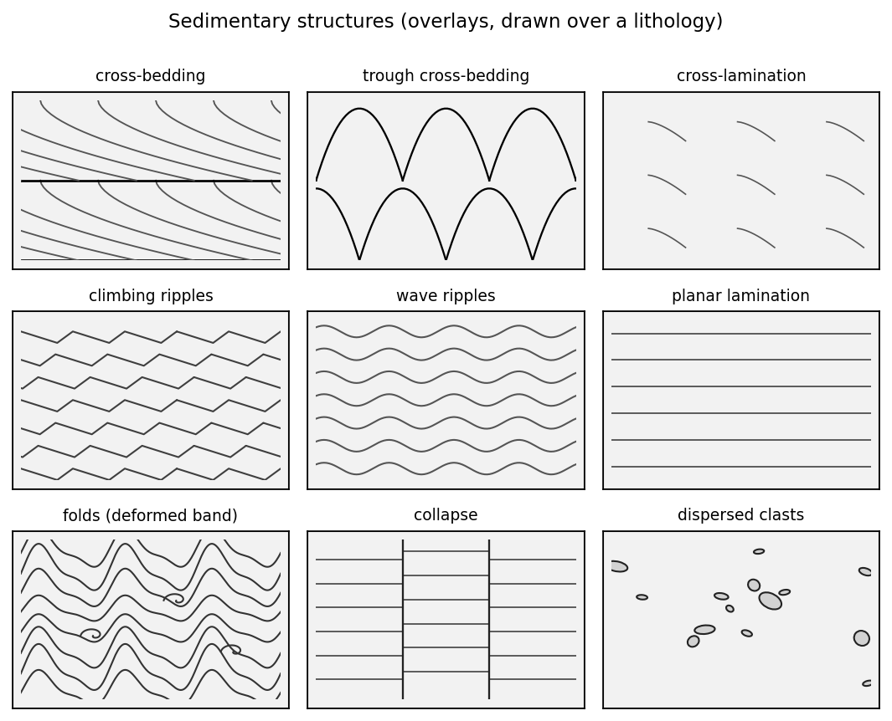

# glacial-strat-patterns

**Fill patterns and sedimentary-structure symbols for glacial / Quaternary
stratigraphic columns** — the black line-work you pour into a measured section,
with a glacial vocabulary the USGS/FGDC lithologic set lacks: diamicton/till
families, rhythmites, **dropstones that deflect the laminae**, cross-bedded
outwash, loess, peat.

Two classes, following how measured-section keys are organised:

- **Lithologies** are tileable **fills** (till, gravel, sand, mud, loess, …) —
  what the unit is *made of*.
- **Sedimentary structures** (cross-bedding, ripples, folds, …) are **overlays**
  drawn *over* a lithology as bands or lenses that need not fill the interval —
  what *happened* to it.

The ornaments are drawn the way a geologist draws them by hand — to **show
process and form**, not just texture. Cross-bed foresets sweep down-current and
flatten tangentially into the bounding surface; gravel is imbricated; ripples
climb; diamict is poorly sorted with no fabric; varves are wavy and uneven.


Lithologies are generated as parametric, seamless **SVG** tiles (the source of
truth) usable via a **matplotlib** column helper, standalone **SVG/PNG**, or an
importable **Inkscape** palette; structures are matplotlib overlays.


## Why this exists

The FGDC patterns (Dave Quinn's `geologic-patterns` repackages them) are the de
facto open set, but their glacial/Quaternary coverage is thin and generic. This
library fills that gap: patterns designed for glacial sedimentology, keyed to
**Eyles/Miall-style lithofacies codes** (`Dmm`, `Dms`, `Sr`, `Fl`, …) with
plain-name aliases, and **parametric** so a facies is a family you tune (clast
density, lamina spacing, stipple density) rather than one frozen tile.

## Lithologies (13 fills)

Tileable fills, keyed to Eyles/Miall-style lithofacies codes with plain-name
aliases (`mpl.column_fill(ax, "Dmm", …)`, by code or alias):

| Code | Alias | Group | |
|------|-------|-------|--|
| `Dmm` | till (massive) | diamicton | matrix-supported, massive — lodgement/subglacial till |
| `Dms` | stratified diamicton | diamicton | matrix-supported, stratified — melt-out / waterlain |
| `Dcm` | clast-rich diamicton | diamicton | clast-supported, massive |
| `Gh` | gravel | glaciofluvial | clast-supported, imbricated |
| `Gms` | matrix-supported gravel | glaciofluvial | debris-flow / ice-marginal diamict |
| `Sr` | ripple-laminated sand | glaciofluvial | climbing-ripple cross-lamination |
| `Sm` | massive sand | glaciofluvial | massive / faintly graded |
| `Fl` | rhythmite / varve | glaciolacustrine | laminated silt & clay couplets |
| `Fm` | massive mud | glaciolacustrine | structureless silt & clay (mud dashes) |
| `Cdm` | colluvium (soliflucted) | colluvial | diamict; clasts aligned down-slope |
| `Em` | loess | eolian | massive eolian silt |
| `P` | peat / organic | organic | bog / fen |
| `R` | bedrock | bedrock | undifferentiated substrate |

## Sedimentary structures (overlays)

A *different class* from lithologies: structures draw **over** a lithology fill
as a band `(x0, x1, y0, y1)` that need not fill the interval — the way
measured-section keys separate "Lithology" from "Sedimentary Structures". In
`glacial_patterns.structures`:

`cross_bedding` · `trough_cross_bedding` · `cross_lamination` ·
`climbing_ripples` (stacked chevrons) · `wave_ripples` · `planar_lamination` ·
`folds` (convolute / recumbent, a deformed band) · `collapse` (ice-contact
faulting) · `dispersed_clasts`



### Placed features

Point/line elements drawn over a fill:

- `mpl.dropstone(ax, x, y, r)` — ice-rafted clast deflecting the laminae (over `Fl`/`Fm`)
- `mpl.boulder_pavement(ax, y, x0, x1)` — a clast line marking a subglacial pavement / lag
- `mpl.pebble_lag(ax, y, x0, x1, imbricate=…)` — a pebble stringer, optionally imbricated
- `mpl.erosion_contact(ax, y, x0, x1)` — a scalloped erosional / scour surface
- `mpl.flame(ax, x, y)` — flame / water-escape (dewatering) structure
- `mpl.mud_rip_up(ax, x, y)` — a mud rip-up clast

Ornament forms are calibrated to published measured-section keys and the USGS
FGDC lithologic-pattern standard (mud dashes, sand stipple, tangential
cross-bed foresets, festoon troughs, chevron climbing ripples). Flow is
left-to-right (one `FLOW` constant flips it).

## Quickstart

```bash
pip install -e .        # numpy, matplotlib, pillow
```

```python
import matplotlib.pyplot as plt
from glacial_patterns import mpl, structures as st

fig, ax = plt.subplots(figsize=(3, 6))
mpl.column_fill(ax, "Dmm", 0, 1, 8, 6)     # till lithology, 8–6 m
mpl.column_fill(ax, "Sm",  0, 1, 6, 4)     # sand lithology, 6–4 m
st.cross_bedding(ax, 0, 1, 6, 4)           # cross-bed structure over the sand
mpl.column_fill(ax, "Fl",  0, 1, 4, 1.5)   # varves, 4–1.5 m
mpl.dropstone(ax, 0.5, 2.4, 0.1)           # ice-rafted clast
ax.set_xlim(0, 1); ax.set_ylim(8, 0)       # depth downward
plt.show()
```

Address a lithology by code (`"Dmm"`) or alias (`"till (massive)"`). Full worked
sections: [`examples/example_column.py`](examples/example_column.py) (lithology
fills + structure overlays + dropstones) and
[`examples/example_structures.py`](examples/example_structures.py).


### Raster tiles vs. vector hatches

Two fill routes, same facies keys:

- `mpl.column_fill(...)` tiles the **raster** PNG — the *faithful* ornament.
- `hatch.column_fill_hatch(...)` uses a matplotlib **hatch** — *vector*,
  resolution-independent, and tiny in PDF/SVG output, at the cost of fidelity
  (built-in hatches only approximate the tiles). Use it for publication figures
  you'll zoom or edit downstream:

```python
from glacial_patterns.hatch import column_fill_hatch
column_fill_hatch(ax, "Gh", 0, 1, 4, 3)    # vector gravel fill
```

See [`examples/example_hatch.py`](examples/example_hatch.py) (writes a
true-vector PDF). Each lithology's hatch string is also in `metadata/facies.csv`.

### Inkscape / Illustrator / QGIS

Not using Python? The `svg/<code>.svg` tiles drop straight in as pattern fills,
and `metadata/facies.csv` is the index. For Inkscape there's a ready-made
palette, [`inkscape/glacial-patterns.svg`](inkscape/glacial-patterns.svg):
open it and copy a swatch, or drop it into your Inkscape user *patterns* folder
to get all 13 lithologies as stock patterns in **Object → Fill and Stroke →
Pattern**. (Structure overlays are matplotlib-only for now.)

## Regenerating the assets

```bash
python -m glacial_patterns.build   # writes svg/, png/, metadata/, contact_sheet, inkscape/
```

Regeneration needs the `inkscape` CLI (used to rasterise SVG → PNG). Editing a
generator in `glacial_patterns/patterns.py` and rebuilding updates every asset.

## Design notes

- **Lithology vs. structure.** Lithologies are fills; structures overlay them.
  Keeping them separate mirrors measured-section keys and lets any structure sit
  on any lithology.
- **Ornament shows process.** Foresets are tangential, gravel imbricated,
  ripples asymmetric and climbing — directional strokes encode flow and form,
  the way field-manual ornaments do. Palaeoflow is drawn **left to right** by
  convention (one `FLOW` constant flips it).
- **Organic, not CAD-regular.** Irregularity is a *deterministic function of
  position*, so clast size, lamina thickness, and waviness vary hand-drawn-style
  while the repeating tile stays seamless.
- **SVG-native tiling.** Each pattern is an SVG `<pattern>`; discrete ornaments
  are wrapped across tile edges (`wrap9`) so repeats are seamless.
- **Deterministic.** A seeded PRNG makes tiles reproducible.
- **Codes + aliases.** Lithofacies code is the primary key; a friendly alias
  resolves to the same facies.

## Roadmap

Optional colour variants per facies, per-facies parameter presets, and further
ornaments (striated/faceted-clast markers, till-fabric arrows, iceberg-turbate).
Contributions of regional facies schemes welcome.

## Licence

- **Code** (`glacial_patterns/`, `examples/`): MIT (`LICENSE`).
- **Pattern assets** (`svg/`, `png/`): CC-BY-4.0 (`LICENSE-patterns.md`) —
  original designs, informed by the public-domain FGDC standard but not copied
  from it.

See also the sibling repo
[gsc-of8572-swatches](https://github.com/MNiMORPH/gsc-of8572-swatches) for GSC
surficial *map-face* colours — the complement to these column fills.
